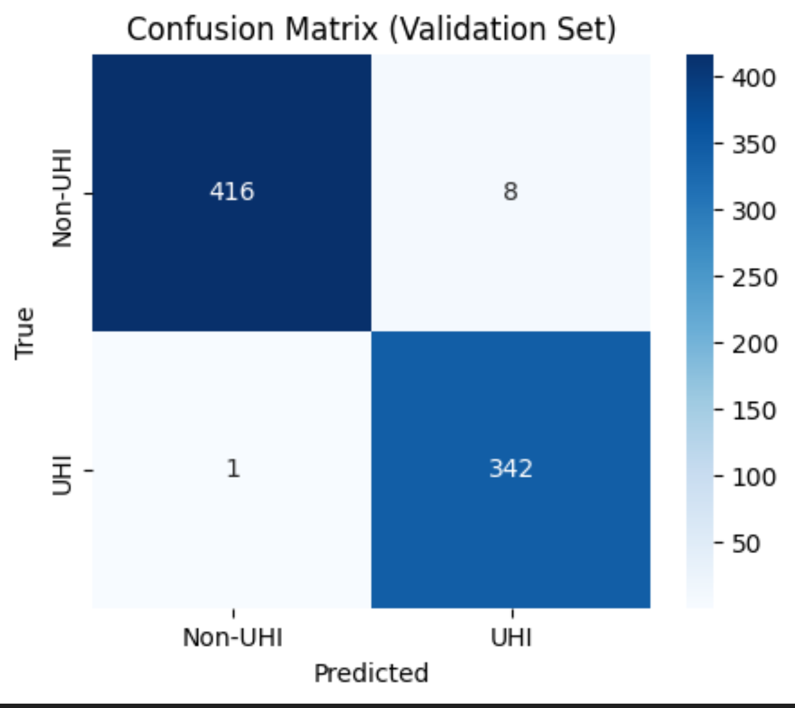
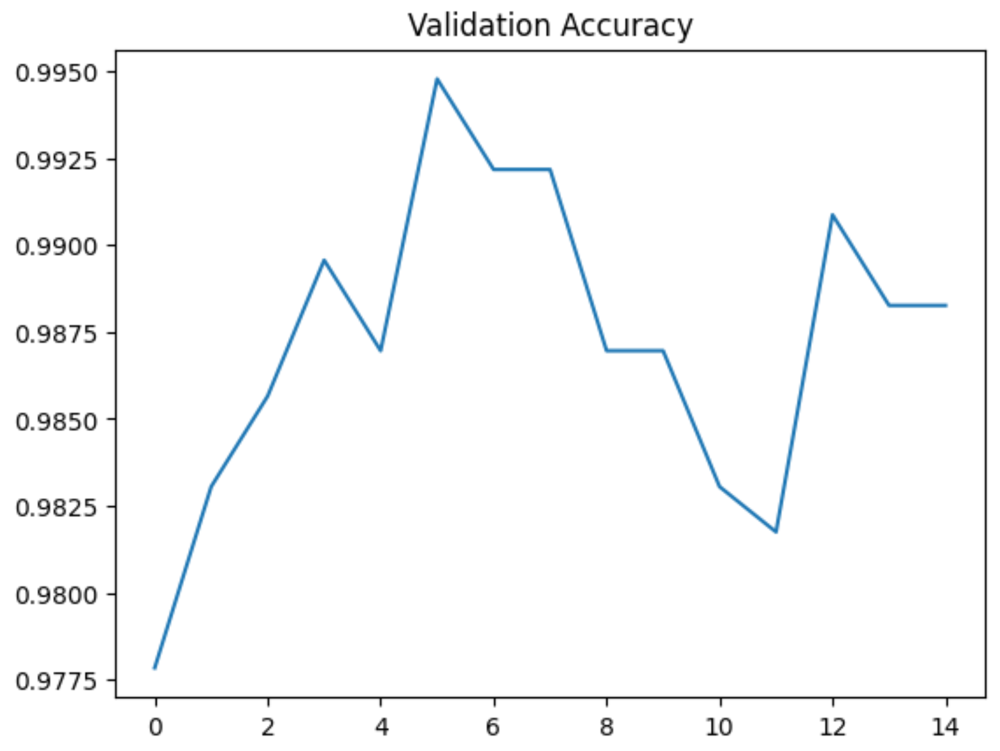
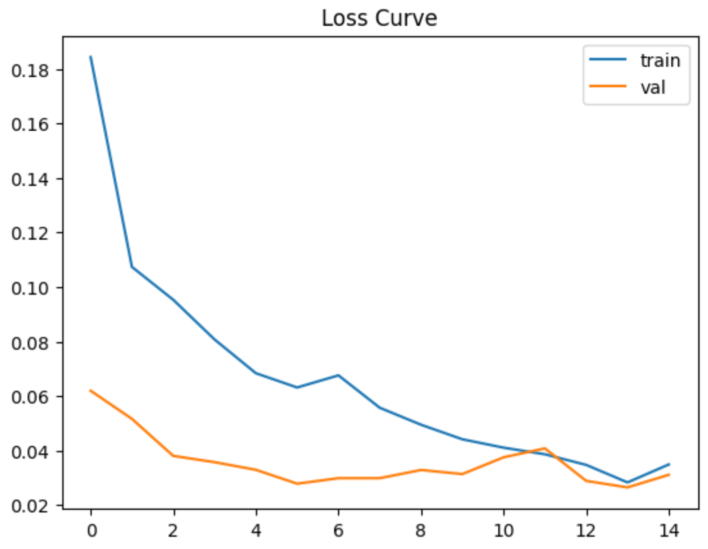
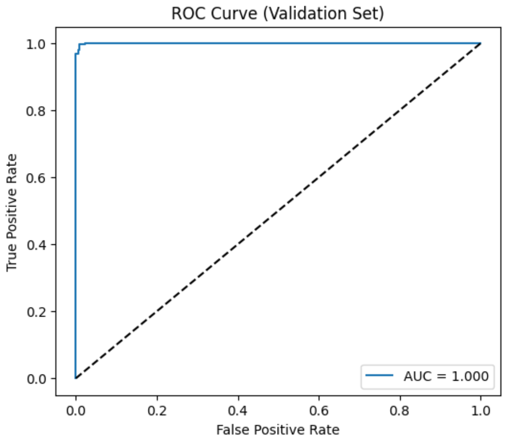

# Urban Heat Island Detection

Urban heat islands (UHIs) make cities hotter than the areas around them. It affects comfort, energy use, and climate resilience.  
In this project, I use daily **Land Surface Temperature (LST)** data in DMV region and train a  **CNN model** to classify each **16×16 patch** as either UHI or non-UHI.  
The model will learn the temperature patterns, and automatically identify the areas that look like heat-island hotspots.

---

## 1. Problem Statement
- **Goal**: Automatically identify heat-prone areas by classifying each 16×16 LST patch as UHI (1) or non-UHI (0).
- **Why it matters**: UHIs make cities hotter, increase energy demand, and can make health risks during heat waves.   Simple thresholding often mislabels hot pixels or cloud noise as UHIs because it doesn’t consider spatial context. A model that understands the “shape” of heat can give much more reliable results.
- **Approach**: Train a CNN model to learn spatial temperature patterns such as clusters, gradients, coherence rather than relying on a single cutoff temperature.
- **Study Area**: DMV metro area (≈38.2–39.8°N, 77.8–76.0°W)

---

## 2. Data
- **Source**: Daily LST GeoTIFFs (`gf_Day2020_<DAY>.tif`).  
  - https://iastate.figshare.com/articles/dataset/A_seamless_1_km_resolution_global_daytime_1_30_PM_land_surface_temperature_dataset_in_2020/14885825
- **Storage**:
  - `data/raw/`: this folder stores the original `.tif` files(not tracked in GitHub). Place downloaded `.tif` files from website.
  - `data/processed/`: this folder stores the NumPy arrays created after preprocessing (patches + labels).

| Set | Days | Notes |
|-----|------|-------|
| Train | 187, 196, 205, 212, 223, 240 | Chosen for a balanced mix of UHI/non-UHI patches |
| Validation | 215 | Held out day for evaluation |

---

## 3. Preprocessing Pipeline
Implemented in `notebook/batch_preprocess.ipynb`.

1. **Clip to the DMV region**  
   Each raw GeoTIFF is cropped to a fixed bounding box around the DMV area.  
   Any invalid or missing values (≤0) are turned into `NaN` so they can be handled later.

2. **Extract patches**  
   I slide a **16×16** window (stride **8**) across the clipped image to create overlapping patches.  
   Earlier I tried much larger patches (like 128×128), but they produced too few samples.  
   The 16×16 size gives a nice balance: many samples, but still enough spatial structure for the CNN to learn from.

3. **Filter out low-quality patches**  
   If more than **30%** of the pixels in a patch are missing, I drop that patch entirely.

4. **Assign labels**  
   For each patch, I compute the percentage of valid pixels above **303 K**.  
   - If more than **50%** are above 303 K → label **1 (UHI)**  
   - Otherwise → label **0 (non-UHI)**  

5. **Build the final datasets**  
   After processing each day, I save the patches and labels as `.npy` files  (e.g., `patches_day205_sw.npy`).  
   Then I merge six days into a **training set** and keep day **215** as the **validation set**.

---

## 4. Modeling & Training
Implemented in `notebook/cnn_traing.ipynb`.

### Architecture
```
Input: 1 × 16 × 16 LST patch (Z-scored per training stats)
Conv2d(1→16, 3×3, padding=1) → ReLU → MaxPool2d(2)  # 16×8×8
Conv2d(16→32, 3×3, padding=1) → ReLU → MaxPool2d(2) # 32×4×4
Flatten → Linear(32*4*4→64) → ReLU → Dropout(0.3)
Linear(64→2) → logits (CrossEntropyLoss handles softmax)
```

### Training Setup
- Batch size: 64
- Epochs: 15
- Input normalization: replace NaNs with patch mean, then Z-score using training-set mean/std.

---

## 5. Evaluation

All evaluation is done on **day 215**, which the model never saw during training.  

### Overall Performance

The model performs extremely well on the validation day:

- **Accuracy:** 0.99  
- **Precision:** 1.00 (Non-UHI), 0.98 (UHI)  
- **Recall:** 0.98 (Non-UHI), 1.00 (UHI)  
- **F1-score:** 0.99 for both classes  
- **AUC:** 1.000  

This means the CNN can very clearly separate UHI patches from non-UHI ones, even under different day-to-day temperature conditions.

### Confusion Matrix

Out of 767 validation patches:

- Only **9 total mistakes**  
- The model almost never confuses small noisy hot spots with actual heat-island patterns  
- It catches nearly every true UHI patch



### Training Curves

The loss curves and accuracy curve look smooth and stable:

- Both training and validation loss steadily go down  
- Validation accuracy stays consistently high 
- No signs of overfitting  
- The simple CNN architecture is actually a perfect match for this task





### ROC Curve

The ROC curve reaches **AUC = 1.0**, which basically means the model can almost perfectly distinguish UHI vs. non-UHI patches based on their predicted probabilities.  



---

## 6. Carbon Accounting

I used **CodeCarbon** to measure the energy use and CO₂ emissions during training.  
Since the model is small and the training loop only runs for a few seconds on CPU, the footprint is extremely tiny.

From the CodeCarbon log (`results/emissions.csv`):

- **Training time:** ~5.3 seconds  
- **Energy consumed:** ~6.7 × 10⁻⁵ kWh  
- **CO₂ emitted:** ~3.1 × 10⁻⁵ kg CO₂  
- **Hardware:** Apple M3 CPU (no GPU used)

These numbers are *very* small — basically close to zero in practical terms.  
This means the model is cheap to retrain, environmentally friendly, and easy to run on ordinary hardware.

---

## 7. Repository Layout
```
.
├── data/
│   ├── processed/               # NumPy arrays created by preprocessing notebooks
│   └── raw/                     # Place MODIS LST GeoTIFFs here (not tracked)
├── notebook/
│   ├── batch_preprocess.ipynb   # ROI clipping, patch extraction, dataset merging
│   ├── cnn_traing.ipynb         # CNN training, evaluation, visualizations
│   └── test_extract_dc_patch.ipynb  # Scratch notebook for ROI sanity checks
├── poster/                      # Final poster 
├── results/
│   ├── emissions.csv            
│   ├── confusion_matrix.png
│   ├── Loss_Curve.png
│   ├── ROC_Curve.png
│   └── Validation_Accuracy.png
├── uhi_env.yml                  # Conda environment definition
└── README.md                
```

---

## 8. Setup & Reproduction Guide
1. **Create environment**
   ```bash
   conda env create -f uhi_env.yml
   conda activate uhi
   ```
2. **Download raw LST scenes**  
   Place `gf_Day2020_<DAY>.tif` files in `data/raw/`.   (187,196,205,215,212,223,240)
    - https://iastate.figshare.com/articles/dataset/A_seamless_1_km_resolution_global_daytime_1_30_PM_land_surface_temperature_dataset_in_2020/14885825
3. **Run preprocessing**  
   Open `notebook/batch_preprocess.ipynb` and execute all cells:
   - ROI clip + patch extraction
   - Merge per-day arrays into `patches_train.npy`, `patches_val.npy`, etc.
4. **Train & evaluate CNN**  
   Run `notebook/cnn_traing.ipynb`:
   - Loads processed `.npy` files
   - Applies NaN replacement & normalization
   - Trains the CNN (CodeCarbon logs automatically)
   - Generates metrics/plots/Grad-CAM
5. **Document carbon cost & results**  
   - Summarize emissions from `results/emissions.csv`

---

